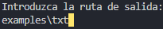

# PGV-01-csv_converter
# Documentación del Código

## Descripción General

Este programa en Java está diseñado para trabajar con datos de archivos CSV y TXT, proporcionando dos funcionalidades principales:
1. **Segregación de datos CSV por una característica especificada por el usuario.**
2. **Conversión de datos de varios archivos TXT a un archivo CSV.**

---

## Funcionalidades

### 1. Segregación de Datos CSV
El programa permite al usuario introducir una ruta de archivo CSV, luego seleccionar una característica por la cual los datos deben ser separados, y finalmente guardar los datos segregados en diferentes archivos de texto.

### 2. Conversión de Archivos TXT a CSV
El programa permite al usuario proporcionar una carpeta con archivos TXT que contienen datos y luego los formatea en un archivo CSV en la ubicación especificada por el usuario.

---

## Ejecución

El programa puede ser ejecutado desde la línea de comandos.

Al iniciar, saldrá un menú como este:

##### Si selecciona la opción 1

Inicialmente se le pedirá la ubicación del csv

> [!NOTE]
> Este es un ejemplo de la ruta donde se encuentra el csv.

Después se le pedirá la ubicación donde quiere que se guarden los datos.

> [!NOTE]
> Este es un ejemplo de la ruta de salida.

Finalmente se le pedirá por cual característica desea separar los datos del csv

> [!NOTE]
> En este caso, se selecciona por la nacionalidad, pero puede escoger la característica que quiera.

Una vez finalizado, obtendrá un mensaje de confirmación de que se han guardado los datos, junto con su ubicación.

##### Estructura de los archivos generados

Si todo finalizó sin errores, la estructura de los txt debería ser la siguiente

>  [!NOTE]
> En este caso son separados por nacionalidades.

##### Si selecciona la opción 2

Inicialmente se le pedirá la ubicación de la carpeta que almacena todos los archivos .txt

> [!NOTE]
> Este es un ejemplo de la ruta donde se encuentra la carpeta de los txt.

Posteriormente deberá indicar la ruta donde quiere que se almacene los datos, además del nombre del archivo csv.

> [!NOTE]
> Este es un ejemplo, puede colocar tanto la ruta de salida como el nombre del csv a gusto.

Una vez finalizado, obtendrá un mensaje de confirmación de que se han guardado los datos, junto con su ubicación.

##### Estructura de los archivos generados

Si todo finalizó correctamente, la estrucutra del archivo .csv generado debería ser la siguiente.

---

## Estructura del Código

### Importaciones
El programa utiliza varias clases de paquetes externos:
- `DataExtractor`: Extrae datos de archivos CSV y TXT.
- `DataFormatter`: Formatea los datos en formato CSV.
- `DataSegregator`: Segrega los datos basados en una característica específica.
- `Menu`: Muestra un menú de opciones al usuario.
- `ProcessLauncher`: Lanza procesos de guardado para manejar los datos segregados.

### Clase Principal `App`

La clase `App` es el punto de entrada del programa. Contiene un método `main` que maneja las operaciones de la aplicación, utilizando un menú interactivo que presenta las opciones al usuario.

#### Mostrar Menú
El programa muestra un menú inicial utilizando la clase `Menu` para que el usuario elija entre las opciones disponibles.

### Opción 1: Segregación de Datos CSV

1. **Lectura de la ruta CSV y de salida**: El programa solicita la ruta del archivo CSV y la ruta donde se guardarán los archivos de salida.
   
2. **Selección de Característica**: El usuario selecciona una característica por la cual desea separar los datos (`Name`, `Nationality`, `Age`, `Profession`).

3. **Extracción y Segregación de Datos**: 
   - Usa `DataExtractor` para obtener los datos del CSV.
   - Usa `DataSegregator` para segregar los datos según la característica seleccionada.

4. **Guardar Datos Segregados**: Crea un proceso para guardar cada conjunto de datos en archivos de texto separados. Usa `ProcessLauncher` para crear un proceso que guarde los datos.

5. **Finalización**: El programa indica que los datos han sido guardados exitosamente en la ruta especificada.

### Opción 2: Conversión de Archivos TXT a CSV

En esta opción, el programa solicita una carpeta con archivos TXT, los convierte en formato CSV y guarda el resultado en la ruta indicada.

### Cierre del Scanner
Finalmente, el programa cierra el `Scanner` para liberar los recursos.

---

## Clases Externas Utilizadas

1. **`DataExtractor`**:
   - `getDataFromCSV(String route)`: Obtiene los datos de un archivo CSV.
   - `getDataFromTxt(String route)`: Obtiene los datos de archivos TXT.

2. **`DataFormatter`**:
   - `formatDataToCSV(ArrayList<String> data)`: Convierte los datos de texto en formato CSV.

3. **`DataSegregator`**:
   - `segregatePopulationByCharacteristic(String[] characteristics, ArrayList<String> list, String characteristic)`: Separa los datos según una característica.

4. **`ProcessLauncher`**:
   - `startProcess(String filePath, String data, String outputPath, String errorPath)`: Lanza un proceso para guardar datos en un archivo.

5. **`Menu`**:
   - `showMenu()`: Muestra el menú de opciones.

---

## Manejo de Errores
Los errores de cada proceso de guardado se registran en la carpeta `logs/`, con un archivo de log para cada proceso que falle.